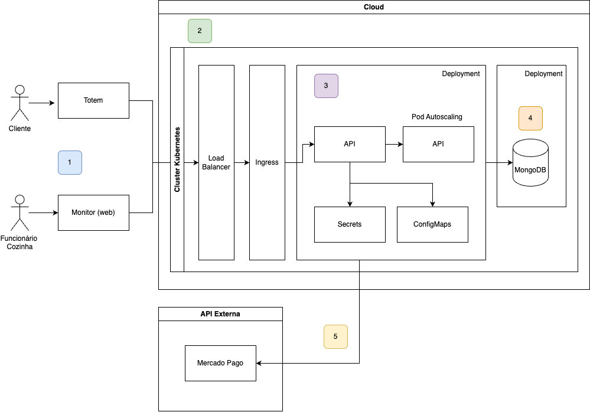

# Tech Challenge - Fast Food System

[Apresentação FIAP - Fase 2](https://youtu.be/vD4L3E_Gviw)

## Descrição do Projeto

O **Tech Challenge** é um projeto desenvolvido como parte da entrega da Pós-Graduação na FIAP. O objetivo é criar um sistema de autoatendimento para uma lanchonete em expansão, que visa melhorar a experiência do cliente e otimizar o gerenciamento de pedidos. O sistema permitirá que os clientes façam pedidos de forma rápida e eficiente, enquanto o estabelecimento poderá gerenciar clientes, produtos e pedidos com mais eficácia.

### Problema

Com o crescimento da lanchonete, a falta de um sistema de controle de pedidos pode levar a confusões e insatisfação dos clientes. Este projeto aborda essas questões, oferecendo uma solução que integra pedidos, pagamentos e acompanhamento em tempo real de forma escalavél e perfomática.

## Funcionalidades

- **Pedido**: Interface para os clientes montarem seus pedidos de forma intuitiva.
- **Pagamento**: Integração com o Mercado Pago via QRCode (Fake checkout).
- ⚠️ **Acompanhamento**: Atualizações em tempo real sobre o status do pedido.
- ⚠️ **Gerenciamento Administrativo**: Painel para gerenciar clientes e produtos, acompanhar pedidos e implementar campanhas promocionais.

## Estrutura do Projeto

- **Backend**: Monolito utilizando arquitetura hexagonal.
- **APIs Implementadas**:
    - Cadastro do Cliente
    - Identificação do Cliente via CPF
    - Criação, edição e remoção de produtos
    - Busca de produtos por categoria
    - Fake checkout integrado ao Mercado Pago para processamento de pedidos
    - Listagem de pedidos
- **Banco de Dados**: MongoDB para armazenamento das informações dos cliente e pedidos.

## Como Rodar o Projeto Localmente

Para iniciar o projeto, você precisará ter o Docker e o Docker Compose instalados. Siga os passos abaixo:

1. Clone o repositório:

```bash
   git clone git@github.com:Fiap-pos-tech-2024/Fast-Food.git
   cd Fast-Food
```

2. Construa e inicie os containers:

```bash
    docker-compose up --build
```

3. Acesse a aplicação em http://localhost:3000

4. Configure o ngrok para ser o webhook:

```bash
npm install -g ngrok
ngrok http 3000
```

Esse comando indica a nossa porta da aplicação para redirecionar. Copie o link gerado e cole na env `MERCADO_PAGO_WEBHOOK`.

Obs: Caso seja a primeira vez, faça login conforme sugerido no terminal.

## Documentação da API

A documentação das APIs está disponível via Swagger. Após iniciar o projeto, você pode acessá-la em http://localhost:3000/api-docs.

## Comandos Kubernetes

Usando minikube para rodar localmente, siga a [instalação aqui](https://minikube.sigs.k8s.io/docs/start/?arch=%2Fmacos%2Farm64%2Fstable%2Fbinary+download#LoadBalancer), e rode o comando abaixo no seu terminal:

```bash
minikube start
minikube dashboard
```

Para aplicar os manifestos no Kubernetes, execute os seguintes comandos:

```bash
kubectl apply -f k8s/configmap.yaml
kubectl apply -f k8s/secret.yaml
kubectl apply -f k8s/deployment.yaml
kubectl apply -f k8s/service.yaml
kubectl apply -f k8s/hpa.yaml
```

Para deletar os recursos no Kubernetes, execute os seguintes comandos:

```bash
kubectl delete -f k8s/deployment.yaml
kubectl delete -f k8s/service.yaml
kubectl delete -f k8s/hpa.yaml
kubectl delete -f k8s/configmap.yaml
kubectl delete -f k8s/secret.yaml
```

## Arquitetura



1.

Os clientes criam os pedidos via totem, onde escolhem os produtos e fazem o pagamento do pedido.
Os funcionários visualizam e atualizam o status de um pedido quando este fica pronto.

2.

Um container criado dentro de um cluster kubernetes, possuindo um load balancer, irá gerenciar o balanceamento de carga da aplicação. Bem como uma ingress que configura uma service e seu host de acesso.

3.

O horizontal pod autoscaling (HPA), garante a escala do serviço quando se tem um aumento de utilização, através do load balancer, podemos configurar o uso de CPU e memória que irá ser o gatilho para que o serviço crie réplicas a fim de atender a demanda.

4.

Recurso do banco de dados em MongoDB configurado dentro do cluster

5.

Consumo de APIs externa para gerenciar os pagamentos de pedidos, com o parceiro Mercado Pago.

## Regras de negócio

Confira no passo-a-passo a seguir um fluxo de geração de pedido com pagamento feito via Mercado Pago.

### Criar cliente

O fluxo para criação de um pedido ínicia na criação ou consulta de um cliente existente, caso este deseje se identificar.

```bash
POST
curl --location 'http://localhost:3000/client' \
--header 'Content-Type: application/json' \
--data-raw '{
  "cpf": "01234567897",
  "name": "john doe",
  "email": "john@teste.com"
}'
```

### Criar pedido

Após o cliente criado, podemos utilizar o id do cliente na criação pedido, permitindo que um pedido seja atribuído a ele. Caso não seja informado id do cliente, o pedido será criado de forma anônima.

```bash
POST
curl --location 'http://localhost:3000/order' \
--header 'Content-Type: application/json' \
--data-raw '{
    "idClient": "678b039fafba99ba4720f853",
    "cpf": "01234567897",
    "name": "john doe",
    "email": "john@teste.com",
    "value": 10,
    "items": [
        {
            "id": 1,
            "name": "Coca-Cola",
            "price": 10,
            "quantity": 1
        }
    ]
}'

```

### Criar pagamento

Após o pedido criado, será gerado um id de pedido, para que seja criado um pagamento, deveremos informar o id do pedido e o id do cliente para criar o pagamento.

```bash
POST
curl --location 'http://localhost:3000/payment/' \
--header 'Content-Type: application/json' \
--data-raw '{
    "order": {
        "idOrder": "678b03caafba99ba4720f855",
        "idClient": "678b039fafba99ba4720f853",
        "cpf": "01234567897",
        "name": "john doe",
        "email": "john@teste.com",
        "status": "WAITING_PAYMENT",
        "value": 10,
        "items": [
            {
                "idProduct": "1",
                "name": "Coca",
                "observation": "gelada",
                "unitValue": 10,
                "price": 10,
                "amount": 1
            }
        ]
    }
}'
```

### Consultar pagamento

Consulte o pagamento criado para gerar o QRcode de pagamento, informando o id de pagamento gerado.

```bash
curl --location 'http://localhost:3000/payment/:idPayment' \
--data ''
```

### Realizar pagamento

Baixe o aplicativo do [Mercado Pago](https://www.mercadopago.com.br/c/app).

Para gerar uma compra de teste, você vai precisar criar uma conta de comprador teste, [veja aqui como](https://www.mercadopago.com.br/developers/pt/docs/subscriptions/additional-content/your-integrations/test/accounts).

Faça o login com seu usuário e senha no aplicativo do Mercado Pago e realize o pagamento através do QRCode.

### Consultar status

Após realizado pagamento com sucesso no aplicativo do Mercado Pago, consulte o status do pedido e do pagamento novamente.

```bash
GET
curl --location 'http://localhost:3000/payment/:idPayment' \
--data ''
```

Deverá retornar com o status **paid**
